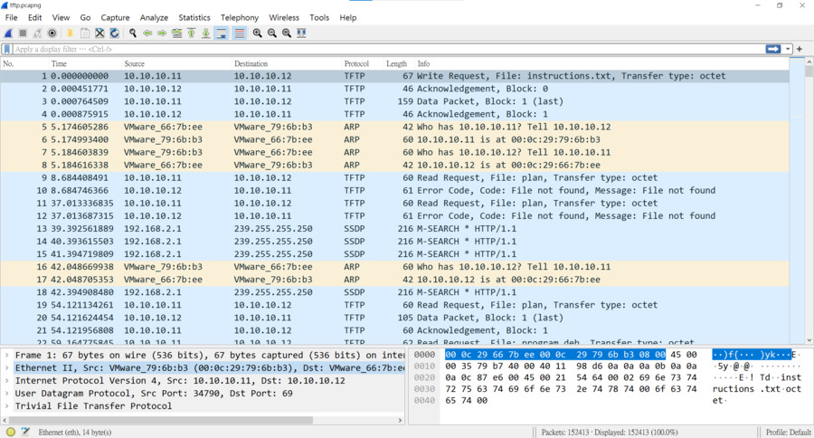
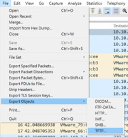

# Trivial Flag Transfer Protocol

## Description
Figure out how they moved the [flag](https://mercury.picoctf.net/static/e4836d9bcc740d457f4331d68129a0bc/tftp.pcapng)

## 解題過程
1. 題目給了一個pcapng檔，大概是wireshark的抓包紀錄，用wireshark開看看。

看起來是普通的流量抓包...

2.題目叫做 Trivial Flag Transfer Protocol google一下發現就是[tftp](https://zh.wikipedia.org/zh-tw/%E7%AE%80%E5%8D%95%E6%96%87%E4%BB%B6%E4%BC%A0%E8%BE%93%E5%8D%8F%E8%AE%AE)簡單來說就是可以帶檔案的protocal，那就用wireshark掃一下。

