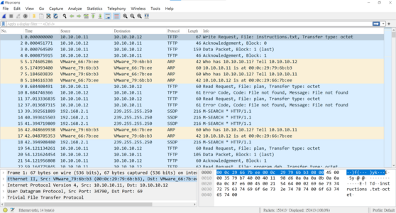
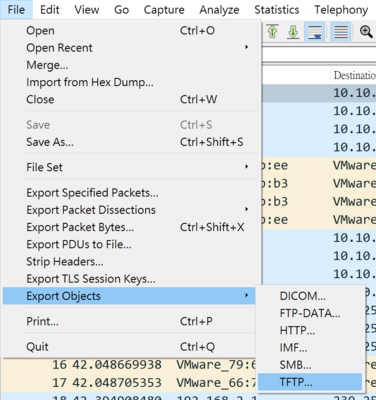
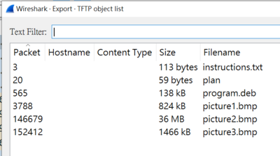

# Trivial Flag Transfer Protocol

## Description
Figure out how they moved the [flag](https://mercury.picoctf.net/static/e4836d9bcc740d457f4331d68129a0bc/tftp.pcapng)

## 解題過程
1. 題目給了一個pcapng檔，大概是wireshark的抓包紀錄，用wireshark開看看。



看起來是普通的流量抓包...

2. 題目叫做 Trivial Flag Transfer Protocol google一下發現就是[tftp](https://zh.wikipedia.org/zh-tw/%E7%AE%80%E5%8D%95%E6%96%87%E4%BB%B6%E4%BC%A0%E8%BE%93%E5%8D%8F%E8%AE%AE)簡單來說就是可以帶檔案的protocal，那就用wireshark掃一下。

>路徑: File >> Export Objects >> TFTP



3. 掃到的檔案先存下來



4. 打開instructions可以看到

```text
GSGCQBRFAGRAPELCGBHEGENSSVPFBJRZHFGQVFTHVFRBHESYNTGENAFSRE.SVTHERBHGNJNLGBUVQRGURSYNTNAQVJVYYPURPXONPXSBEGURCYNA
```
 
plan裡面長這樣

```text
VHFRQGURCEBTENZNAQUVQVGJVGU-QHRQVYVTRAPR.PURPXBHGGURCUBGBF

```

從純英文字母的這個pattern來看很可能是[substitution](https://zh.wikipedia.org/wiki/%E6%9B%BF%E6%8D%A2%E5%BC%8F%E5%AF%86%E7%A0%81)
丟到[cyberchef](https://gchq.github.io/CyberChef/)試試
可以發現最後是[rot13](https://zh.wikipedia.org/wiki/ROT13)

解密後

instruction

```text
TFTP DOESNT ENCRYPT OUR TRAFFIC SO WE MUST DISGUISE OUR FLAG TRANSFER.FIGURE OUT A WAY TO HIDE THE FLAG AND I WILL CHECK BACK FOR THE PLAN
```

plan

```text
I USED THE PROGRAM AND HID IT WITH-DUEDILIGENCE.CHECKOUT THE PHOTOS
```